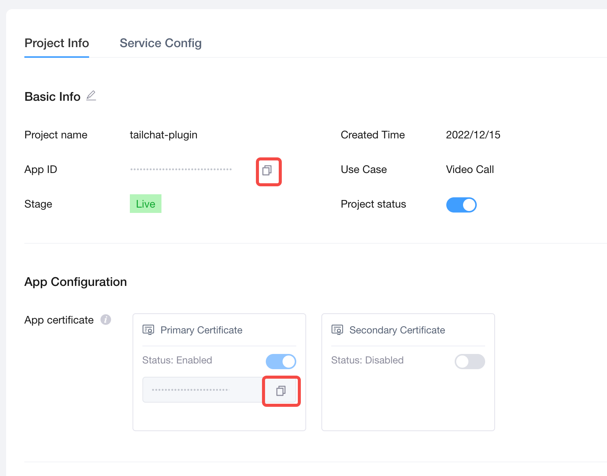
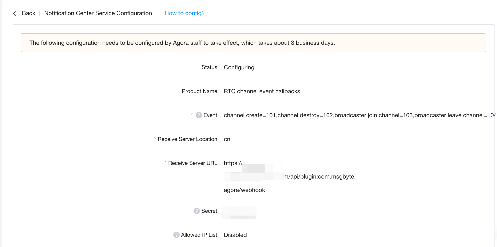

:::info
The agora plugin needs to ensure that your `tailchat` image version is 1.4.0+
:::

## Apply for projects on the agora platform

The Tailchat agora integration is an audio and video call function that relies on the agora service, so it needs to be registered on the agora platform before use.

Agora website: [https://www.agora.io/](https://www.agora.io/)

### Get configuration parameters

After registration/login, it will automatically jump to the console. Project configuration can be done in the console

If you have not created a project, you need to create a project first. As shown below

It is recommended to use safe mode to avoid being stolen by others.

Next we need to get some configuration items to configure the Tailchat's agora plugin.

In project configuration we can get `appid` and `app cert`. These two are the environment variables `AGORA_APP_ID` and `AGORA_APP_CERT` that we will use later

### Get client credentials

In addition, we also need to obtain the customer's permission at the `RESTful API` in the upper right corner,

The operation is as shown in the figure:

In this way we get two other environment variables: `AGORA_CUSTOMER_KEY` and `AGORA_CUSTOMER_SECRET`.

Our initial preparations are complete

## Install plugin

At present, the server-side plugin of the Agora plugin has been installed by default, and you do not need to do anything. However, environment variables need to be configured for use.

### Configure environment variables

To configure environment variables, see [environment variables](../deployment/environment.md)

The agora plugin requires environment variables as follows:

- `AGORA_APP_ID`: the application id of the Agora project
- `AGORA_APP_CERT`: AGORA project certificate
- `AGORA_CUSTOMER_KEY`: AGORA customer id
- `AGORA_CUSTOMER_SECRET`: AGORA customer secret key

These environment variables can be obtained in the above tutorial.

After configuring the environment variables, every will be final

## Application service status callback

:::info
you can skip it if you dont need it.
:::

In order to synchronize the call status to `Tailchat`, it is necessary to apply for a server callback in Agora.

In project configuration, we need to enable `Notification Center Service Configuration` in `Service Config`

Need to subscribe to the following events:

- channel create=101
- channel destroy=102
- broadcaster join channel=103
- broadcaster leave channel=104

The receiving server URL is generally: `https://<YOUR SERVER DOMAIN>/api/plugin:com.msgbyte.agora/webhook`, where `<YOUR SERVER DOMAIN>` is replaced with your `Tailchat` domain name.

:::info
The service of Agora will check the connectivity of the server, so it is necessary to configure the environment variables and start the service before performing this step.

In addition, the Agora needs to configure `https` and `webrtc` service also depends on `https`, so you need to ensure that the server gateway supports the `https` protocol
:::

After the configuration is complete, you will see the following prompt. It will take effect after the confirmation of the staff of the agora.

